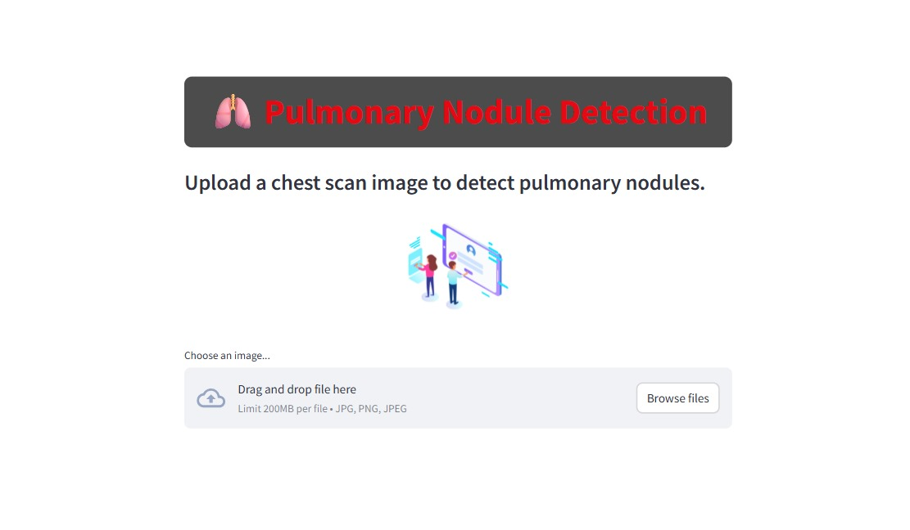
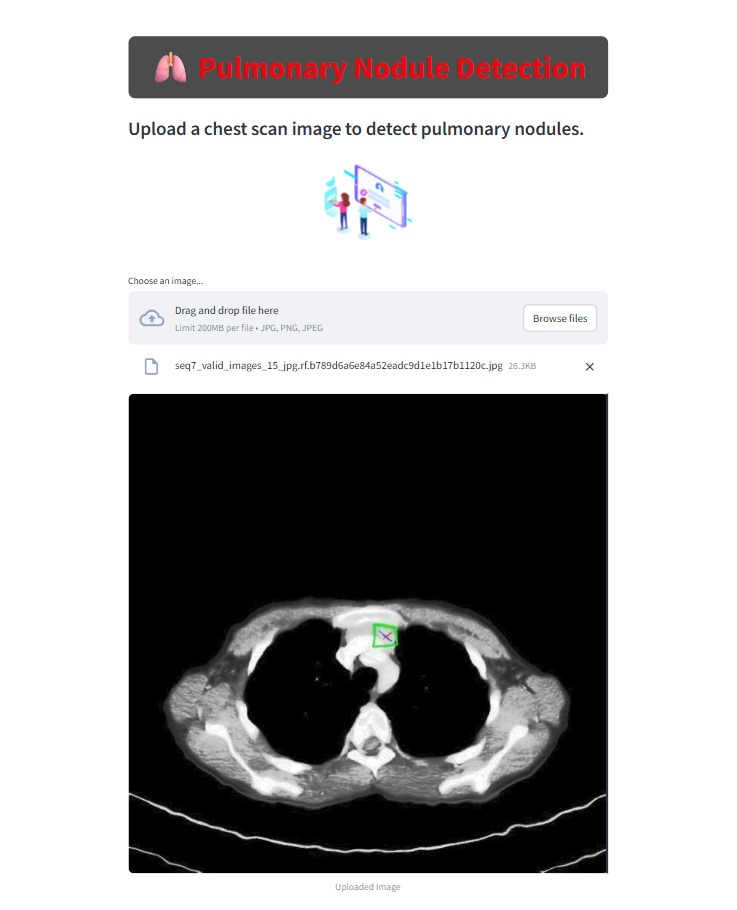
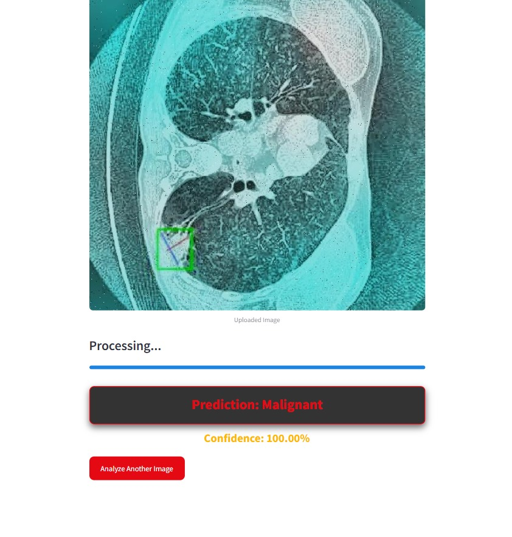

# 🫁 Pulmonary Nodule Detection using Deep Learning

This project focuses on **early detection of pulmonary nodules** (possible signs of lung cancer) from CT scan images using **deep learning techniques**. The system classifies CT images into categories such as **benign, malignant, or unlabeled**, helping in assisting radiologists for faster and more accurate diagnosis.

---

## 📌 Features
- Preprocessed **lung CT scan dataset**.
- Deep learning model for **pulmonary nodule detection**.
- Trained using **TensorFlow/Keras + CNN** (Convolutional Neural Networks).
- **Streamlit web app** for interactive image upload and detection.
- **Grad-CAM explainability** to visualize affected regions in lung scans.
- Scalable and extendable for real-world deployment.

---

## 📂 Project Structure
pulmonary-nodule-detection/
│
├── models/
│   └── final_pulmonary_nodule_model.keras      # Trained CNN model
│
├── app/
│   └── app.py                                 # Streamlit web app
│
├── requirements.txt                           # All dependencies
├── README.md                                  # Project documentation
└── assets/                                    # Optional: logos, sample images, etc.


---

## 📊 Dataset

The dataset used for this project consists of **CT scan images** categorized into:  
- `Benign`  
- `Malignant`  
- `Unlabeled`

🔗 **Download Dataset Here:**  
👉  https://drive.google.com/drive/folders/13rm43Xh3vW7hnpfQD-7whYM9_kUgzCvY?usp=drive_link

> ⚠️ Note: The dataset is **not stored in this repository** due to large file size. Only small sample images are included.

---

## ⚙️ Installation & Setup

1. **Clone this repository**
   ```bash
   git clone https://github.com/HarshaVardhan4223/Pulmonary_nodule_detection.git
   cd Pulmonary_nodule_detection

   Create virtual environment:

   python -m venv venv
source venv/Scripts/activate   # On Windows
source venv/bin/activate       # On Linux/Mac

Download dataset from the Google Drive link
 and place it inside  --   pulmonary_nodule_detection/models/final_pulmonary_nodule_model.keras

▶️ Run the Application

Once setup is complete, run:

streamlit run app.py


Then open your browser and go to:

http://localhost:8501

🖼️ How It Works

Upload a chest CT scan image (JPG/PNG).

The image is preprocessed and passed to the CNN model.

The model predicts whether the image is Benign, Malignant, or Unlabeled.

A confidence percentage and styled results are displayed on the UI.

🩻 Sample Images & Model Predictions
<p align="center">    </p> <p align="center">   </p> <p align="center"> <b>Figure:</b> Sample chest scan images and corresponding model predictions shown in the Streamlit app. </p>

💡 Features

✅ Deep learning–based pulmonary nodule classification
✅ Stylish Netflix-inspired Streamlit UI
✅ Real-time predictions with progress animation
✅ Lottie loading animation integration
✅ Clean, modular code structure

🧩 Code Highlights

Model Loading (cached for efficiency):

@st.cache_resource
def load_model():
    model = tf.keras.models.load_model(model_path)
    return model


Image Preprocessing:

def preprocess_image(image):
    image = np.array(image.convert("RGB"))
    image = cv2.resize(image, (224, 224))
    image = image / 255.0
    return np.expand_dims(image, axis=0)


Prediction:

prediction = model.predict(processed_image)
predicted_class = class_names[np.argmax(prediction)]
confidence = np.max(prediction) * 100

📊 Future Enhancements

🚀 Integrate Grad-CAM explainability for highlighting affected regions
📱 Build a Flutter-based mobile interface for model interaction
☁️ Deploy on Streamlit Cloud or Hugging Face Spaces

🙌 Contributors

Singarapu Harshavardhan – Project Development & Deployment


📜 License

This project is licensed under the MIT License – feel free to use and modify with proper attribution.


⭐ Acknowledgements

Dataset source: Roboflow

TensorFlow/Keras for deep learning

Streamlit for web app


